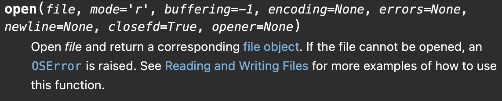
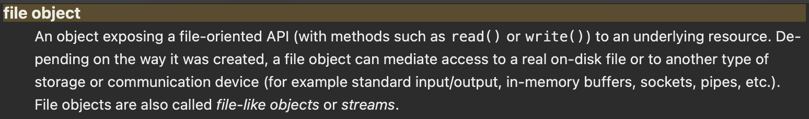

:title: Introduction
:revealjs_theme: solarized
:source-highlighter: highlight.js

= Introduction

== Java - A Compiled Language

image::java-compile.svg[Static]
- do you know other compiled languages?
- can you name an interpreted language?

== Java - A Statically Typed Language

- What does a type say?

[%step]
--
- How to interpret information, e.g., number vs. character
- Which operations can be applied and what are their semantics
--
[%step]
- Do you know a dynamically typed language?

== Why types and compiling?

- Compiler can
  * optimize
  * *check your code for errors*
- A strict and powerful type system can help with that

=== Example in Java

[source, java]
----
public class Adder {
    public static int add(int a, int b) {
        return a + b;
    }
}
----

.Certainly a mistake
[source, java]
----
public class Main {
  public static void main(String[] args){

    String a = "hello, world!";
    System.out.println(Adder.add(a, 5)); // compiler will complain
  }
}
----

What would happen in a dynamically typed language, e.g., python?

=== Example in Python

[source, python]
----
def add(a, b):
    return a + b

if __name__ == "__main__":
    a = "hello, world"
    print(add(a, 2))
----

- We only find out at runtime
- But we actually need to reach the problematic statement

== Types as Contracts

=== A Quick Look at Python

[%step]

But what is _file_?
And what can I do with a _file object_?
Will there be exceptions?

=== Comparing to Java

- `FileWriter(*File* file)`
* Constructs a `*FileWriter*` given the `*File*` to write, using the platform's default charset
- `public void write(*String* str) throws *IOException*`
* Writes a string

=== How to Create a File in Java

- `File(*String* pathname)`
* Creates a new `*File*` instance by converting the given pathname string into an abstract pathname

== Java: an Object-Oriented Language

- You all know functions and data structures
  * function specifies *behaviour*, e.g., `add(a, b)`
  * data structure combines different data fields into a meaningful state, e.g., `(Date) {.day=01, .month=01, year=2025}`
- An object is an entity that combines *state* and *behaviour*.
- Data and behaviour are typically tightly coupled (one does not make sense without the other)

=== How to Create a New Object
Use the `new` keyword

[source, java]
----
public class Main {
    public static void main(String[] args) {
        File a = new File("config.txt");
    }
}
----

=== Classes - Object Definitions
Like a blueprint for each object
[source, java]
----
public class MyClass {}
----

=== Classes - Defining a Method
A function associated with an object.
[source]
----
METHOD := VISIBILITY ["static"] RETURN_TYPE
          NAME "(" PARAM_LIST ")" "{"
          STATEMENT_SEQUENCE "}"
VISIBILITY := "public" | "private" | "default"
PARAM_LIST := PARAM ["," PARAM_LIST]
PARAM := TYPE NAME
RETURN_TYPE := TYPE
----

[source, java]
----
public class MyClass {
    public int add(int a, int b) {
        return a + b;
    }
}
----

=== Classes - Defining an Attribute
An attribute associated with an object.

[source, java]
----
public class MyClass {
    int my_attribute;
}
----

=== Classes - Initial Values of Attributes

[source, java]
----
public class MyClass {
    int my_attribute = 0;
}
----

=== Classes - Initial Values of Attributes
For more flexibility use a constructor.
It will be called when you construct a new object with `new`.
[source, java]
----
public class MyClass {
    int my_attribute;

    public MyClass(int initial_value) {
        my_attribute = initial_value;
    }
}
----

=== Classes - Static Members

- Owned by the class instead of the objects
- `main` function is `static`
- static things exist prior to program startup
- We can call `Main.main(["my_first_arg"])` without an object of class `Main`

=== Overloading
Choose a method based on input parameter types.
[source, java]
----
public class MyClass {
  public int add(int a, int b) {
    return a + b;
  }

  public int add(float a, float b) {
    System.out.println("Gotcha!!!");
    return 0; // Liskov Violation
  }
}
----

== Hands On - Pizza Configurator

- A pizza is made up of different types of doughs, sauces, cheeses, vegan toppings, vegetarian toppings, non-vegetarian toppings
- Define a data structure to model a pizza
- Load a file with possible ingredients
- Write a `PizzaBuilder` class that we can use to set different ingredients and finally create a new `Pizza` object

=== Hands On - Pizza Configurator

- Write a program that asks the user via stdin for each of these choices and finally prints the pizza to stdout

== Next Time

A Closer Look at the Type System and Polymorphism